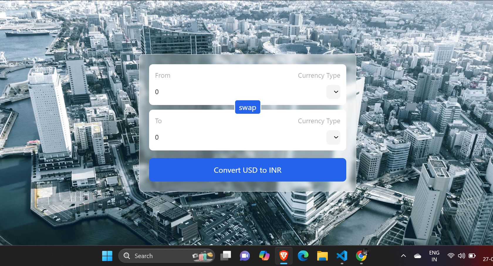

# React Practice Projects

This repository contains a collection of practice projects aimed at improving React development skills. Each project covers different aspects of React, from basic components to advanced concepts such as state management, routing, hooks, and more.

  &nbsp;_(Click on the logo to view my projects)_

## Table of Contents

- [Getting Started](#getting-started)
- [Projects](#projects)
- [Technologies Used](#technologies-used)
- [Installation](#installation)
- [Contributing](#contributing)
- [License](#license)

## Getting Started
- 1. Clone this repository:  `git clone https://github.com/aditiiprasad/React-Practice-Projects.git`
- 2. Install dependencies: `npm install`   
- 3. Navigate into a project directory (e.g., `cd 03-password-generator` )
- 4. Start the development server: `npm start` for react and `npm run dev` for Vite

## Projects

| Projects   | Preview     |
|-------------|-------------|
| <a href="01-Counter-Button/"> 1.Counter Button</a> | |
| <a href="02-Background-Changer/">2.Background Changer</a> | |
| <a href="03-Password-Generator/">3.Password Generator</a> |  |
| <a href="04-currency-convertor">4.Currency Convertor</a> |  |

<!-- | Row 1 Col 1 | Row 1 Col 2 |

| Row 2 Col 1 | Row 2 Col 2 | -->
 