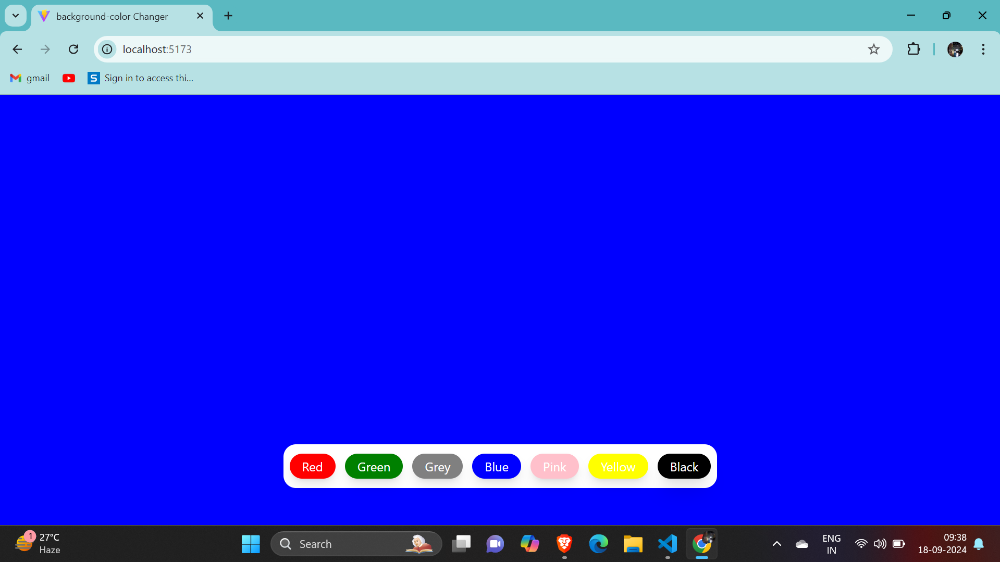
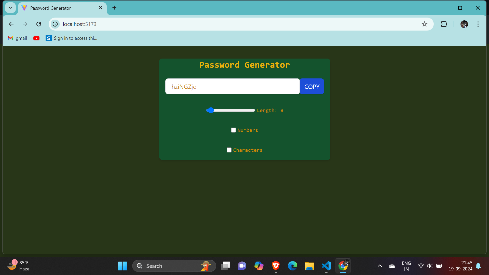

# React Practice Projects

This repository contains a collection of practice projects aimed at improving React development skills. Each project covers different aspects of React, from basic components to advanced concepts such as state management, routing, hooks, and more.

 [](https://aditiiprasad.github.io/React-Practice-Projects/) <span style="color:red">&nbsp;_(Click on the logo to view my projects)_</span>

## Table of Contents


- [Projects](#projects)
- [Technologies Used](#technologies-used)
- [Installation](#installation)
- [Contributing](#contributing)
- [License](#license)


## Projects

| Projects   | Preview     |
|-------------|-------------|
| <a href="01-Counter-Button/"> 1.Counter Button</a> | |
| <a href="02-Background-Changer/">2.Background Changer</a> | |
| <a href="03-Password-Generator/">3.Password Generator</a> |  |
| <a href="04-currency-convertor">4.Currency Convertor</a> |  |


<!-- | Row 1 Col 1 | Row 1 Col 2 |

| Row 2 Col 1 | Row 2 Col 2 | -->

## Technologies Used

This project was built using the following technologies:

- **React** - JavaScript library for building user interfaces.
- **Vite** - A fast development build tool for modern web projects.
- **HTML5** - Markup language for structuring web pages.
- **CSS3** - Styling language used for the look and layout of the project.
- **Tailwind CSS** - Utility-first CSS framework for rapidly building custom user interfaces.
- **JavaScript (ES6+)** - Programming language for implementing interactive functionality.
- **Node.js** - JavaScript runtime used for running the development server.
- **NPM** - Node package manager used for managing dependencies.


## Installation 

- 1. Clone this repository:  `git clone https://github.com/aditiiprasad/React-Practice-Projects.git`
- 2. Navigate into a project directory (e.g., `cd 03-password-generator` )
- 3. Install dependencies: `npm install`   
- 4. Start the development server: `npm start` for react and `npm run dev` for Vite

 
## Contributing

Contributions are welcome! To contribute, follow these steps:

1. **Fork the Repo**  
   - Click "Fork" to create your own copy.

2. **Clone the Repo**  
   - Clone your forked repository:
     ```bash
     git clone https://github.com/your-username/react-practice-project.git
     ```

3. **Create a New Branch**  
   - For your feature or fix:
     ```bash
     git checkout -b feature/branch-name
     ```

4. **Commit Changes**  
   - After making changes, commit with a clear message:
     ```bash
     git commit -m "Brief description of changes"
     ```

5. **Push Changes**  
   - Push your branch to GitHub:
     ```bash
     git push origin feature/branch-name
     ```

6. **Submit a Pull Request**  
   - Open a PR to merge into the `main` branch.

## License

This project is licensed under the MIT License. See the [LICENSE](./LICENSE) file for details.
